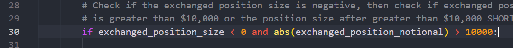

* Documentation

** Setup

Make sure you are located at the project directory in your terminal. Then, execute the following command to install all the necessary dependencies.

```
pip install -r requirements.txt
```

*** Starting the app

Now you can successfully try the app by running the main file!

```
python main.py
```

** Operation

If nothing shows up is because no important positions where found. If you want to test the app, even if there are no important positions, you can change the degree of acceptance of positions.

Change the 10000 in the main.py file at line 30 into a smaller value.




Let's change it to 0 and see the result:


To see the most recent funding payments of a trader, you click at the row of the trade, and a new pop up with the 5 most recet funding payments will appear. (This part might be wrong, there is not a lot of robust documentation to work with.)


